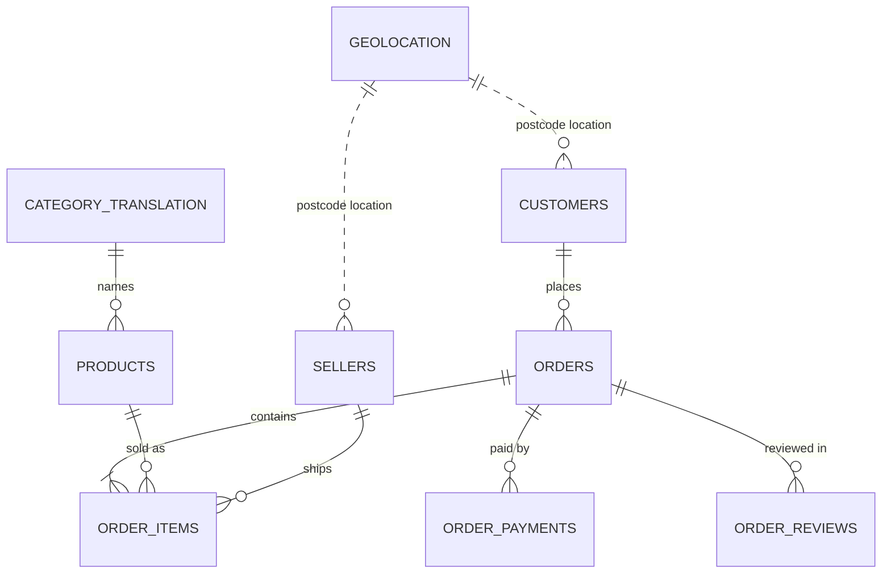

# 📦 Late Deliveries, Lost Stars
### An end-to-end data analysis of 99,441 real e-commerce orders from Brazil

[](https://github.com/YOUR-USERNAME/olist-delivery-analytics/actions/workflows/run-notebooks.yml)


---

## 📖 Table of contents

1. [The project in one minute](#one-minute)
2. [The business question](#business-question)
3. [Key findings](#key-findings)
4. [The data](#the-data)
5. [How the analysis is organised](#five-levels)
6. [Level 1 · Data cleaning & modelling](#level-1)
7. [Level 2 · Exploratory analysis](#level-2)
8. [Level 3 · Logistics performance](#level-3)
9. [Level 4 · Statistics & customer segmentation](#level-4)
10. [Level 5 · Prediction, forecasting & text analysis](#level-5)
11. [Recommendations](#recommendations)
12. [Limitations](#limitations)
13. [How to run the project](#how-to-run)
14. [Project structure](#structure)
15. [Glossary](#glossary)
16. [Data licence & credits](#licence)

---

<a id="one-minute"></a>
## ⏱️ The project in one minute

Olist is a Brazilian company that lets small shops sell on big online marketplaces. It published a real, anonymised copy of
about **100,000 orders** placed between **2016 and 2018**.

I used Python to answer one practical question:

> **How reliable is delivery, how much does a late parcel hurt customer satisfaction, and can we predict which orders will be late?**

The short answer:

- 🚚 **About 1 in 15 orders arrives late** (6.8 %).
- ⭐ A late parcel drops the average review from **4.29 to 2.27 stars**.
- 📉 Late orders are only 6.8 % of deliveries but cause **almost a third (32.6 %) of all 1-2 star reviews**.
- 🤖 Lateness can be partly predicted at checkout - but a careless testing method would have chosen the wrong model.

<p align="center">
  
  <br><em>Review scores stay high while a parcel is early, then fall sharply as soon as it is late.</em>
</p>

---

<a id="business-question"></a>
## ❓ The business question

An online marketplace lives on trust. Customers who have a bad experience leave bad reviews and do not come back.
This project looks at delivery from four angles:

| Angle | Question |
|---|---|
| **Performance** | How fast are deliveries, and how often do they miss the promised date? |
| **Cause** | Where do delays come from - the seller, the carrier, the distance, the region? |
| **Impact** | How much does a late delivery change the customer's review? |
| **Prevention** | Can we flag risky orders in advance and plan for demand? |

---

<a id="key-findings"></a>
## 🔑 Key findings

| # | Finding | Evidence |
|---|---|---|
| 1 | **Lateness is the biggest driver of bad reviews** | Late orders average 2.27★ vs 4.29★ on time. Even after accounting for price, freight, basket size and region, a late delivery makes a 1-2★ review **about 18 times more likely** (odds ratio; 95 % range 17.4-19.5). |
| 2 | **Delays build up with the carrier** | Late parcels spend a median **26.2 days** in transit vs **7.0 days** for on-time parcels. Seller handling only grows from 2.1 to 3.5 days. |
| 3 | **Slow sellers cause late deliveries** | When a seller hands the parcel to the carrier after the deadline, **21.1 %** of orders arrive late, compared with **5.4 %** otherwise. |
| 4 | **Distance and region matter** | The late rate rises from **4.5 %** under 100 km to **12.1 %** above 2,000 km. The North-East is worst (Alagoas **21.5 %**, Maranhão **17.5 %**). |
| 5 | **Customers in slow regions are not "harder to please"** | Once lateness is in the model, region adds almost nothing. Those customers simply receive more late parcels. |
| 6 | **Busy periods cause problems** | After the Black Friday peak (Nov 2017) the late rate rose to 12.4 %, and in March 2018 it reached **19.0 %**. |
| 7 | **Almost nobody buys twice** | Only **3.0 %** of 93,096 customers placed more than one order; only **0.5 %** came back the following month. |
| 8 | **Test models the way they will be used** | With a random test split, gradient boosting looked best (ROC AUC 0.795). Tested on *future* months it dropped to 0.662, and the simpler logistic regression won (0.717). |
| 9 | **Reviews talk about delivery** | A text model reads Portuguese reviews very accurately (ROC AUC 0.957). Strong negative phrases include *"não recomendo"* (don't recommend) and *"não chegou"* (hasn't arrived). |

---

<a id="the-data"></a>
## 🗂️ The data

**Source:** [Brazilian E-Commerce Public Dataset by Olist](https://www.kaggle.com/datasets/olistbr/brazilian-ecommerce) on Kaggle.
The 9 tables are included in [`data/raw`](data/raw), compressed to 42 MB, so you do **not** need a Kaggle account.

| Table | Rows | One row is… |
|---|---:|---|
| orders | 99,441 | an order, with its status and five timestamps (purchase → delivery) |
| customers | 99,441 | the customer of an order, with city, state and postcode |
| order_items | 112,650 | one item in an order, with price, freight cost and seller |
| order_payments | 103,886 | one payment for an order (card, *boleto* bank slip, voucher…) |
| order_reviews | 99,224 | a customer review: 1-5 stars plus optional text |
| products | 32,951 | a product, with category, weight and size |
| sellers | 3,095 | a seller, with city and state |
| geolocation | 1,000,163 | a postcode with latitude and longitude |
| category_translation | 71 | Portuguese → English category names |

### How the tables connect



### The delivery timeline of an order

```
 Purchase ──► Approval ──► Handed to carrier ──► Delivered to customer
    │                            │                       │
    │◄─── seller handling ──────►│◄── carrier transit ──►│
    │◄─────────── total delivery time ──────────────────►│
    │◄─────────── promised (estimated) delivery time ──────────────────►│
```

An order is **late** when it is delivered after the promised date.

---

<a id="five-levels"></a>
## 🧭 How the analysis is organised (5 levels)

Each level is one Jupyter notebook, from simple to advanced. Each one builds on the previous one.

| Level | Notebook | Type of analysis | Main skills shown |
|:---:|---|---|---|
| 1 | [01_data_cleaning](notebooks/01_data_cleaning.ipynb) | Data engineering | joining tables, data-quality checks, feature creation |
| 2 | [02_exploratory_analysis](notebooks/02_exploratory_analysis.ipynb) | Descriptive - *what happened?* | trends, distributions, geography, charts |
| 3 | [03_logistics_performance](notebooks/03_logistics_performance.ipynb) | Diagnostic - *why did it happen?* | KPIs, root-cause analysis, scorecards |
| 4 | [04_statistics_segmentation](notebooks/04_statistics_segmentation.ipynb) | Inferential - *is it real?* | hypothesis tests, regression, clustering, cohorts |
| 5 | [05_prediction_forecast_nlp](notebooks/05_prediction_forecast_nlp.ipynb) | Predictive - *what will happen?* | machine learning, forecasting, text analysis |

> 💡 You do not need to run anything to see the results - GitHub displays every notebook with its tables and charts.

---

<a id="level-1"></a>
### Level 1 · Data cleaning & modelling

**Goal:** turn 9 separate files into **one clean table with one row per order**.

1. **Loaded** all 9 tables and converted the date columns to real dates.
2. **Checked the keys.** Every ID that should be unique is unique, and every link between tables (order → customer,
   item → product, item → seller…) points to a record that exists. Result: **0 problems in 13 checks**.
3. **Explained the missing values** instead of filling them in blindly:
   - review text is often missing because writing a comment is optional;
   - delivery dates are missing for orders that were never delivered (cancelled, unavailable, still on the way);
   - about 1.9 % of products have no category, so they are labelled `unknown`.
4. **Checked the timeline** for impossible events. For example, 1.4 % of delivered orders were scanned by the carrier
   *before* the payment was approved. These orders were kept but flagged, and the seller/carrier split was left blank
   for the 189 orders whose timeline did not add up.
5. **Created new columns (features):** delivery days, promised days, days late, seller-to-customer distance (km),
   freight-to-price ratio, main product category and more.

**Result:** `orders_master` - **99,441 orders × 52 columns**, used by all the other notebooks.

<p align="center"></p>

---

<a id="level-2"></a>
### Level 2 · Exploratory analysis

**Goal:** understand the business before looking for problems.

- **Analysis window:** January 2017 - August 2018 (20 complete months, 99.6 % of all orders). The first and last months
  contain very few orders and would distort the trends.
- **Growth:** orders in Jan-Aug 2018 were **+135 %** on the same months of 2017.
- **Biggest month:** Black Friday, November 2017, with **7,544 orders**.
- **Products:** **18 of 74 categories** make 80 % of revenue (the "80/20 rule"), led by health & beauty, watches & gifts,
  and bed/bath/table.
- **Payments:** **75 %** of orders are paid by credit card, often split into instalments (3.6 on average); 20 % use *boleto*,
  a Brazilian bank slip. Bigger baskets are split into more instalments.
- **Geography:** customers live all over Brazil, but **70 %** of orders are shipped by sellers in São Paulo state, so
  **64 %** of parcels cross a state border.
- **Shopping times:** most orders are placed on weekdays during working hours; weekends are quieter.

<p align="center">
  
  
</p>

---

<a id="level-3"></a>
### Level 3 · Logistics performance

**Goal:** measure delivery quality and find where it breaks down (96,203 delivered orders).

| KPI | Value |
|---|---|
| Late-delivery rate | **6.8 %** |
| Median delivery time | **10.2 days** |
| Median promised time | **23.2 days** |
| Late orders - median days late | 7 days |
| Average review: on time / late | **4.29 / 2.27** |

What the analysis shows:

- **Promises are very cautious.** Most parcels arrive about 12 days *before* the promised date. That keeps the late rate low,
  but a long promised time can put customers off at checkout.
- **The late rate jumps after busy periods:** 12.4 % in November 2017, 14.1 % in February 2018 and **19.0 %** in March 2018.
- **Distance:** the further a parcel travels, the longer it takes and the more often it is late.
- **Seller hand-over:** sellers who miss their shipping deadline are linked to almost **4x** more late deliveries.
- **Carrier transit** is where late parcels lose most of their time.
- **Seller scorecard:** 205 sellers with 100+ orders handle 60 % of deliveries; sellers with more late deliveries get lower
  reviews (correlation -0.45).

<p align="center">
  
  
</p>
<p align="center">
  
  
</p>

---

<a id="level-4"></a>
### Level 4 · Statistics & customer segmentation

**Goal:** prove the patterns are real, and understand the customers.

**1 · Is the review gap real?**
With 95,560 reviewed orders almost any difference looks "significant", so I also measured **how big** each effect is:

| Test | Result | Meaning |
|---|---|---|
| Mann-Whitney U | p < 0.001, effect size **0.64** | late orders really do get lower scores - a **large** effect |
| Chi-square | Cramér's V **0.40** | a strong link between "late" and "1-2 stars" |
| Spearman correlation | rho **0.54** | longer distance goes with longer delivery time |

**2 · What makes a bad review more likely?** (logistic regression)
The odds ratio shows how much each factor multiplies the chance of a 1-2★ review, with the other factors held constant.

| Factor | Odds ratio |
|---|---:|
| Delivered late | **18.4** |
| Order from several sellers | 3.5 |
| Order with several items | 2.8 |
| Higher freight-to-price ratio | 1.4 |
| Region (compared with the South-East) | ≈ 1 (little or no effect) |

<p align="center"></p>

**3 · Customer segments (RFM + k-means)**
RFM describes each customer by **R**ecency (days since last order), **F**requency (number of orders) and **M**onetary value
(total spent). The k-means algorithm then groups similar customers; 4 groups gave the best separation.

| Segment | Share of customers | Typical spend | Suggested action |
|---|---:|---:|---|
| Recent low spenders | 37.9 % | R$ 66 | cross-selling, free-shipping thresholds |
| Recent high spenders | 29.6 % | R$ 212 | protect the experience, encourage a second order |
| Lapsed one-time buyers | 29.5 % | R$ 98 | low-cost win-back campaigns |
| Repeat buyers | 3.0 % | R$ 226 | loyalty rewards - the most valuable group |

**4 · Cohort retention:** in every monthly group of new customers, fewer than 1 in 100 ordered again the following month.
Olist depends on **finding new customers**, which makes a good first delivery even more important.

<p align="center"></p>

---

<a id="level-5"></a>
### Level 5 · Prediction, forecasting & text analysis

**A · Can we predict a late delivery at checkout?**

- **Fair features only:** the model uses information known when the order is placed - promised days, distance, basket,
  payment, time of day, how busy the platform is, and the **track record** of the seller and of the delivery route.
  Track records only use deliveries completed *before* the order, so the model never "sees the future".
- **Fair test:** trained on orders from Jan 2017 - Mar 2018 and tested on **later** orders (Apr - Aug 2018), just like real use.

| Model | Random split (ROC AUC) | Time split (ROC AUC) |
|---|---:|---:|
| Logistic regression | 0.740 | **0.717** ✅ chosen |
| Gradient boosting | **0.795** | 0.662 |

The more complex model looked better on a random split but failed on future data, because it memorised the busy periods of
the training months. **Lesson: always test a model the way it will be used.**

What the chosen model can do: flag the riskiest **10 %** of orders, which contain **23 %** of all late deliveries and are late
**2.3x** more often than average. It is a useful early-warning flag, not a perfect predictor - many delays come from events
nobody can see at checkout (strikes, carrier congestion).

<p align="center">
  
  
</p>

**B · How many orders next week?**
Three methods were compared on the last 12 weeks of data:

| Method | Average error (MAPE) |
|---|---:|
| Same as last week | 34.5 % |
| **Average of the last 4 weeks** | **21.4 %** ✅ |
| Holt trend model | 25.4 % |

The simple 4-week average won. Demand had stopped growing, and the test period included the **truck drivers' strike of
late May 2018**, which upset trend-based models.

<p align="center"></p>

**C · What do unhappy customers write?**
A text model (TF-IDF + logistic regression) was trained on **40,523** written reviews in Portuguese.

| Metric | Result |
|---|---|
| ROC AUC | **0.957** |
| 1-2★ reviews correctly found (recall) | **92 %** |
| Overall accuracy | **90 %** |

Delivery words (*entrega*, *prazo*, *chegou*, *recebi*…) appear in **65 %** of negative reviews.

<p align="center"></p>

---

<a id="recommendations"></a>
## 💼 Recommendations for the business

1. **Make on-time delivery the #1 customer-satisfaction target**, and warn customers *before* a parcel becomes late.
2. **Set a seller service level:** reward sellers who hand parcels over on time and act on those who don't.
3. **Score carriers by route:** most delay happens in transit, so renegotiate or replace the worst routes.
4. **Use region-specific promised dates** for the North and North-East, and book extra carrier capacity before peaks.
5. **Use the risk model as an early-warning flag** - choose a faster carrier or adjust the promise for risky orders.
6. **Plan weekly volumes on a 4-week rolling average**, adjusted by hand for known events (Black Friday, strikes).
7. **Invest in the second purchase:** with only 3 % repeat customers, even a small gain in retention is valuable.

---

<a id="limitations"></a>
## ⚠️ Limitations

- The data covers **2016-2018**; delivery networks in Brazil have changed since then.
- The promised date comes from Olist's own system, which we cannot see or change.
- Reviews are voluntary, so happy and unhappy customers may not review at the same rate.
- Less than two years of history means yearly seasonality (for example a second Black Friday) cannot be modelled.
- Distances are straight lines between postcode centres, not real road routes.

---

<a id="how-to-run"></a>
## ▶️ How to run the project

**You need:** Python 3.10 or newer (3.12 recommended) and Git.

```bash
# 1. Download the project
git clone https://github.com/YOUR-USERNAME/olist-delivery-analytics.git
cd olist-delivery-analytics

# 2. Create a virtual environment (keeps these packages separate from the rest of your computer)
python -m venv .venv
source .venv/bin/activate          # Windows: .venv\Scripts\activate

# 3. Install the packages
pip install -r requirements.txt

# 4. Open the notebooks
jupyter lab
```

Then open `notebooks/01_data_cleaning.ipynb` and run the notebooks **in order, 01 → 05**.

To run all five notebooks automatically:

```bash
python scripts/run_all_notebooks.py           # runs them and saves the results into the notebooks
python scripts/run_all_notebooks.py --check   # runs them without changing any file
```

A full run takes about 1-2 minutes on a normal laptop.

### ✅ Automatic testing
Every time code is pushed to GitHub, a **GitHub Actions** workflow installs the packages on a fresh machine and runs all five
notebooks from start to finish. The green badge at the top of this page means the last run succeeded. Before publishing, the
notebooks were also tested with both pandas 2.2 and pandas 3.0.

---

<a id="structure"></a>
## 📁 Project structure

```
olist-delivery-analytics/
│
├── data/
│   ├── raw/                        # the 9 original Olist tables (.csv.gz)
│   ├── processed/                  # created by notebook 01 (not stored in Git)
│   └── README.md                   # data source, licence and row counts
│
├── notebooks/
│   ├── 01_data_cleaning.ipynb
│   ├── 02_exploratory_analysis.ipynb
│   ├── 03_logistics_performance.ipynb
│   ├── 04_statistics_segmentation.ipynb
│   └── 05_prediction_forecast_nlp.ipynb
│
├── reports/figures/                # all 23 charts, saved automatically by the notebooks
│
├── scripts/
│   ├── run_all_notebooks.py        # runs every notebook in order
│   └── download_data.py            # optional: download the data again from Kaggle
│
├── src/olist_analysis/             # reusable Python code
│   ├── data.py                     # loading, quality checks, cleaning, master table
│   └── plotting.py                 # chart style and saving
│
├── .github/workflows/
│   └── run-notebooks.yml           # automatic test on every push
│
├── requirements.txt                # Python packages needed
├── LICENSE                         # MIT licence for the code
└── README.md                       # this page
```

**Why a `src` folder?** The cleaning and joining logic is written **once** in `src/olist_analysis` and reused by every
notebook. The notebooks stay short and readable, and a fix in one place applies everywhere.

### Tools used

| Purpose | Libraries |
|---|---|
| Data handling | pandas, NumPy |
| Charts | Matplotlib, Seaborn |
| Statistics | SciPy, statsmodels |
| Machine learning & text | scikit-learn |
| Notebooks & automation | Jupyter, nbconvert, GitHub Actions |

---

<a id="glossary"></a>
## 📚 Glossary of terms

| Term | Plain-English meaning |
|---|---|
| **Late rate** | share of delivered orders that arrived after the promised date |
| **Median** | the middle value - half the orders are below it, half above; less affected by extreme cases than the average |
| **p-value** | how likely a result this strong would be if there were really no difference; small = unlikely to be chance |
| **Effect size** | how *big* a difference is, not just whether it exists |
| **Odds ratio** | how many times a factor multiplies the odds of an outcome (1 = no effect, 18 = eighteen times the odds) |
| **RFM** | describing customers by Recency, Frequency and Monetary value |
| **k-means** | an algorithm that groups similar customers together |
| **Cohort** | customers who made their first purchase in the same month |
| **ROC AUC** | how well a model ranks risky cases above safe ones: 0.5 = random guessing, 1.0 = perfect |
| **Precision / recall** | precision = of the orders flagged, how many were really late; recall = of all late orders, how many were flagged |
| **Data leakage** | accidentally giving a model information it would not have in real life (for example, from the future) |
| **Time-based split** | training on older data and testing on newer data, as happens in real use |
| **MAPE** | average forecasting error as a percentage of the actual value |
| **TF-IDF** | a way of turning text into numbers that highlights the most distinctive words |

---

<a id="licence"></a>
## 📄 Data licence & credits

- **Data:** [Brazilian E-Commerce Public Dataset by Olist](https://www.kaggle.com/datasets/olistbr/brazilian-ecommerce),
  licensed [CC BY-NC-SA 4.0](https://creativecommons.org/licenses/by-nc-sa/4.0/). It is shared here unchanged (only compressed)
  for non-commercial, educational use, with credit to Olist.
- **Code:** [MIT licence](LICENSE) - free to reuse with attribution.

---

## 👤 Author

**YOUR NAME** - data analyst & database developer

[LinkedIn](https://www.linkedin.com/in/YOUR-LINKEDIN) · [GitHub](https://github.com/YOUR-USERNAME) · YOUR-EMAIL

If you found this project useful, a ⭐ on the repository is appreciated!
