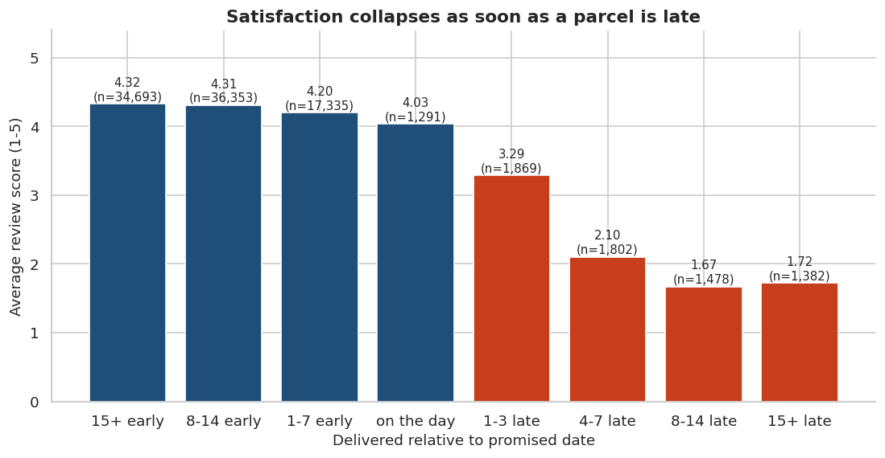
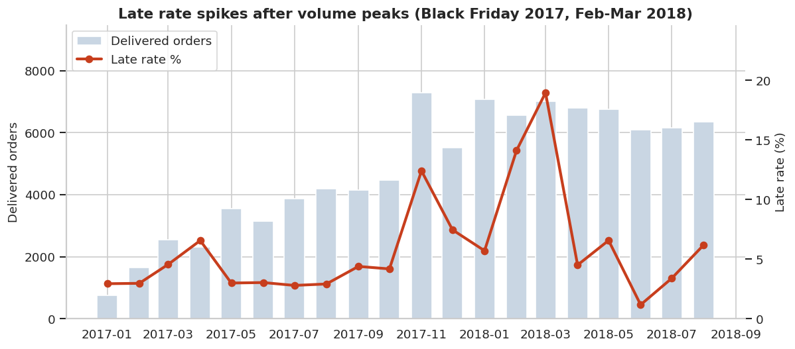
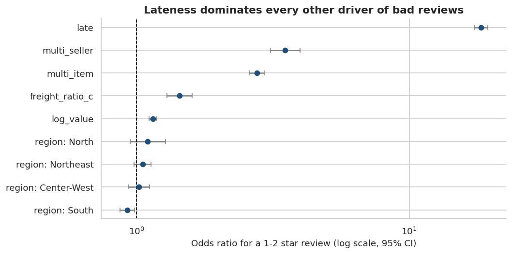
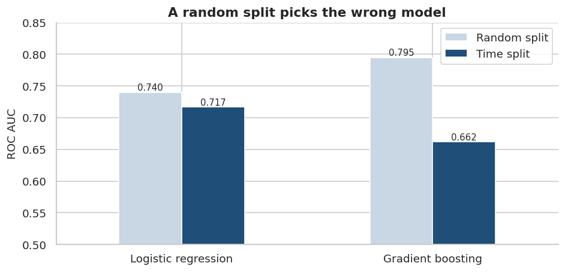
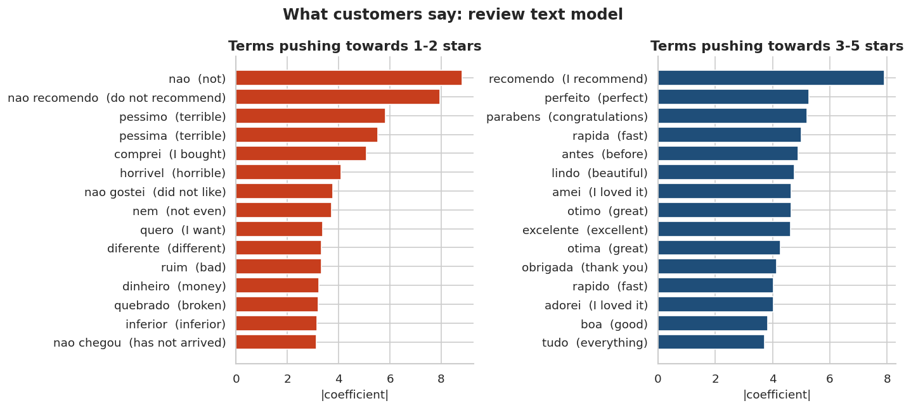

# Late Deliveries, Lost Stars - Olist E-Commerce Analytics

[](https://github.com/YOUR-USERNAME/olist-delivery-analytics/actions/workflows/run-notebooks.yml)


An end-to-end analysis of **99,441 real orders** from Olist, a Brazilian e-commerce marketplace, built in five levels - from
data cleaning to machine learning - around one business question:

> **How reliable is delivery, what does a late parcel cost in customer satisfaction, and can we see it coming?**

Every notebook runs top to bottom on a fresh clone; a GitHub Actions workflow re-executes all five on every push.

---

## Key findings

| | Finding |
|---|---|
| ⭐ | Late orders average **2.27 stars vs 4.29** on time. They are **6.8 %** of deliveries but **32.6 %** of all 1-2 star reviews. |
| 📈 | Holding price, freight, basket and region constant, a late delivery multiplies the odds of a 1-2 star review by **~18x** (95 % CI 17.4-19.5). |
| 🚚 | For late parcels the time is lost mostly in **transit**: a median **26.2 days** with the carrier vs **7.0** for on-time orders. |
| 🏭 | Sellers who miss the shipping deadline cause **21.1 %** late deliveries vs **5.4 %** for those who don't. |
| 🗺️ | The North-East is late most often (Alagoas **21.5 %**). Once lateness is controlled for, **region no longer predicts bad reviews**. |
| 🔁 | Only **3.0 %** of 93,096 customers ever ordered twice - an acquisition business, not a retention one. |
| 🤖 | A random train/test split would have picked the **wrong model**. On a realistic time split, logistic regression (ROC AUC 0.717) beats gradient boosting (0.662). |
| 💬 | A transparent text model reads Portuguese reviews with **ROC AUC 0.957**; its top negative phrases include *"não recomendo"* and *"não chegou"* ("has not arrived"). |

<p align="center">
  
</p>

---

## The five levels

| # | Notebook | Level | What it shows |
|---|---|---|---|
| 01 | [Data cleaning & modelling](notebooks/01_data_cleaning.ipynb) | Data engineering | Joins 9 tables, validates every primary/foreign key (0 violations), explains missing data, flags impossible timelines, engineers delivery features |
| 02 | [Exploratory analysis](notebooks/02_exploratory_analysis.ipynb) | Descriptive | Orders **+135 %** year on year, Black Friday peak, Pareto (18 of 74 categories = 80 % of revenue), payments, geography, shopping hours |
| 03 | [Logistics performance](notebooks/03_logistics_performance.ipynb) | Diagnostic | Late rate by month and state, promise vs reality, review impact, distance, seller hand-over, carrier transit, seller scorecard |
| 04 | [Statistics & segmentation](notebooks/04_statistics_segmentation.ipynb) | Inferential | Mann-Whitney & chi-square with effect sizes, logistic regression with odds ratios, RFM + k-means, cohort retention |
| 05 | [Prediction, forecast & NLP](notebooks/05_prediction_forecast_nlp.ipynb) | Predictive | Leakage-safe late-delivery model with time-based validation, weekly demand forecast vs baselines, Portuguese review classifier |

<p align="center">
  
  
</p>
<p align="center">
  
  
</p>

---

## Recommendations for the business

1. **Make on-time delivery the #1 satisfaction KPI** and send proactive delay messages before the promised date passes.
2. **Seller SLA:** rank and penalise sellers on hand-over speed - missed shipping limits quadruple the late rate.
3. **Carrier scorecards by lane:** transit time is where delays accumulate; renegotiate the worst seller-state → customer-state lanes.
4. **Region-aware promise dates** for the North and North-East, and capacity reserved ahead of peaks (Black Friday, Feb-Mar).
5. **Use the risk model as a flag, not an oracle:** flagging the riskiest 10 % of orders catches 23 % of late deliveries at 2.3x the average rate.
6. **Plan weekly volume on a rolling 4-week average** (it beat Holt's trend model, MAPE 21 % vs 25 %) with manual overrides for known events.

---

## Methods worth a closer look

- **Leakage-safe features** - seller and shipping-lane track records use only deliveries completed *before* each order was placed (`pd.merge_asof`), with empirical-Bayes smoothing for small histories.
- **Honest validation** - time-based split (train Jan 2017 - Mar 2018, test Apr - Aug 2018) compared side by side with a random split.
- **Effect sizes, not just p-values** - with ~95k orders everything is "significant"; rank-biserial correlation, Cramér's V and odds ratios with confidence intervals show *how much* it matters.
- **Reproducible** - shared logic lives in [`src/olist_analysis`](src/olist_analysis), notebooks only orchestrate; CI re-runs everything on every push.

---

## Run it yourself

```bash
git clone https://github.com/YOUR-USERNAME/olist-delivery-analytics.git
cd olist-delivery-analytics
python -m venv .venv
source .venv/bin/activate            # Windows: .venv\Scripts\activate
pip install -r requirements.txt
jupyter lab                          # open notebooks/01_data_cleaning.ipynb
```

Run every notebook from the command line instead:

```bash
python scripts/run_all_notebooks.py
```

The data (42 MB, gzip-compressed) is included in [`data/raw`](data/raw), so no download is needed.

## Project structure

```
olist-delivery-analytics/
├── data/
│   ├── raw/                  # 9 original Olist tables (.csv.gz)
│   └── README.md             # source, licence, row counts
├── notebooks/                # 01 → 05, executed with outputs
├── reports/figures/          # every chart, saved by the notebooks
├── scripts/
│   ├── download_data.py      # re-download from Kaggle (optional)
│   └── run_all_notebooks.py  # executes all notebooks in order
├── src/olist_analysis/       # loading, cleaning, master table, chart style
├── .github/workflows/        # CI: runs all notebooks on every push
└── requirements.txt
```

## Data & licence

Data: [Brazilian E-Commerce Public Dataset by Olist](https://www.kaggle.com/datasets/olistbr/brazilian-ecommerce), licensed
[CC BY-NC-SA 4.0](https://creativecommons.org/licenses/by-nc-sa/4.0/) - redistributed here unmodified for non-commercial,
educational use. Code: [MIT](LICENSE).

---

**YOUR NAME** · [LinkedIn](https://www.linkedin.com/in/YOUR-LINKEDIN) · [GitHub](https://github.com/YOUR-USERNAME)
