# Logistics & Inventory Database - SQL Server

**VerdantStackDB** is a complete operational database for a fictional hydroponics distributor with sites in Leeds, Bristol and
Rotterdam: warehouse network, stock, purchasing, sales orders, FEFO allocation, packing, shipping and carrier tracking.
All business data is invented - nothing is copied from a public dataset.

One script builds everything: **27 tables, 2 functions, 14 views, 13 stored procedures, 4 triggers, seed data and a live demo**.

## Design highlights

| Technique | Where it is used |
|---|---|
| **Three hierarchy patterns** | `hierarchyid` for the warehouse network (network → region → site → zone → aisle → bin), product categories and the org chart · adjacency list for customer accounts and pallet → carton packaging · recursive bill of materials for kits that contain kits |
| **Set-based FEFO allocation** | `usp_AllocateSalesOrder` reserves earliest-expiring stock with a running total (`SUM() OVER`) - no cursor - and skips expired lots and dock stock |
| **Group credit control** | `usp_CreateSalesOrder` walks *up* the customer tree to the group account, then *down* to total open exposure across every branch |
| **Append-only stock ledger** | every movement is logged; an `INSTEAD OF` trigger blocks edits; the demo rebuilds every balance from the ledger (0 mismatches expected) |
| **Integrity in the schema** | check constraints (allocated ≤ on hand, movement direction per type), filtered unique indexes (one preferred supplier per product), computed columns, `rowversion` |
| **Safe concurrency** | `XACT_ABORT` + TRY/CATCH + `THROW`, `UPDLOCK/HOLDLOCK` on read-then-write rows, numbered business errors |
| **Business rules** | chilled / hazmat temperature zones, hazardous goods only on approved carrier services, service weight limits, BOM cycle detection |

## Run it

1. Open **`VerdantStackDB_Complete.sql`** in SQL Server Management Studio (or Azure Data Studio).
2. Press **F5**. The script drops and recreates `VerdantStackDB`, so it can be re-run any time.
3. Read the **Messages** tab: a working day runs through the procedures, including seven deliberate rule violations that are caught and explained.

Prefer to read it in stages? The same code is split into [`steps/`](steps):
[01 structure](steps/01_structure.sql) · [02 functions & views](steps/02_functions_views.sql) ·
[03 procedures & triggers](steps/03_procedures_triggers.sql) · [04 seed data](steps/04_seed_data.sql) ·
[05 demo & showcase queries](steps/05_demo_showcase.sql)

Requirements: SQL Server 2019 or later (Developer and Express editions work). The GitHub Actions badge above builds the whole
database on a SQL Server 2022 container on every push.

## Entity-relationship diagram

```mermaid
erDiagram
    %% ===================== CORE =====================
    Core_Country {
        char CountryCode PK
        nvarchar CountryName UK
        char CurrencyCode
    }
    Core_UnitOfMeasure {
        varchar UomCode PK
        nvarchar UomName
        varchar UomClass
    }
    Core_AuditLog {
        bigint AuditId PK
        sysname TableName
        nvarchar RecordKey
        sysname ColumnName
        nvarchar OldValue
        nvarchar NewValue
        datetime2 ChangedAt
    }

    %% ===================== ORG =====================
    Org_Department {
        int DepartmentId PK
        varchar DepartmentCode UK
        nvarchar DepartmentName
    }
    Org_Employee {
        int EmployeeId PK
        hierarchyid OrgNode UK "org chart tree"
        int OrgLevel "computed"
        nvarchar FirstName
        nvarchar LastName
        nvarchar JobTitle
        int DepartmentId FK
        int HomeSiteId FK
        varchar Email UK
        date HireDate
    }

    %% ===================== INVENTORY =====================
    Inventory_Category {
        int CategoryId PK
        hierarchyid CategoryNode UK "taxonomy tree"
        varchar CategoryCode UK
        nvarchar CategoryName
        varchar HazardClass "inherited"
    }
    Inventory_Location {
        int LocationId PK
        hierarchyid LocationNode UK "network to bin"
        varchar LocationCode UK
        varchar LocationType "NETWORK REGION SITE ZONE AISLE BIN"
        varchar TemperatureClass "zone only"
        varchar ZonePurpose "STORAGE or STAGING"
        char CountryCode FK
        decimal MaxVolumeM3
        decimal MaxWeightKg
    }
    Inventory_Supplier {
        int SupplierId PK
        varchar SupplierCode UK
        nvarchar SupplierName
        char CountryCode FK
        smallint LeadTimeDays
        decimal QualityRating
    }
    Inventory_Product {
        int ProductId PK
        varchar Sku UK
        nvarchar ProductName
        int CategoryId FK
        varchar BaseUom FK
        decimal StandardCost
        decimal ListPrice
        int ReorderPoint
        bit IsLotTracked
        smallint ShelfLifeDays
        bit IsKit
        varchar TemperatureClass
    }
    Inventory_ProductSupplier {
        int ProductId PK, FK
        int SupplierId PK, FK
        varchar SupplierSku
        decimal UnitCost
        int MinOrderQty
        bit IsPreferred "one per product"
    }
    Inventory_KitComponent {
        int KitProductId PK, FK
        int ComponentProductId PK, FK
        decimal QtyPer
    }
    Inventory_Lot {
        int LotId PK
        int ProductId FK
        varchar LotNumber
        int SupplierId FK
        date ManufacturedOn
        date ExpiresOn
    }
    Inventory_StockBalance {
        int StockBalanceId PK
        int ProductId FK
        int LocationId FK "bin"
        int LotId FK
        decimal QtyOnHand
        decimal QtyAllocated
        decimal QtyAvailable "computed"
        rowversion RowVer
    }
    Inventory_StockTransaction {
        bigint TxnId PK
        varchar TxnType "append-only ledger"
        int ProductId FK
        int LotId FK
        int FromLocationId FK
        int ToLocationId FK
        decimal Quantity
        varchar ReferenceType
        int EmployeeId FK
        datetime2 TxnAt
    }
    Inventory_PurchaseOrder {
        int PurchaseOrderId PK
        varchar PoNumber UK
        int SupplierId FK
        int ShipToSiteId FK
        date ExpectedDate
        varchar Status
        int CreatedBy FK
    }
    Inventory_PurchaseOrderLine {
        int PoLineId PK
        int PurchaseOrderId FK
        smallint LineNumber
        int ProductId FK
        decimal QtyOrdered
        decimal QtyReceived
        decimal UnitCost
    }

    %% ===================== LOGISTICS =====================
    Logistics_Customer {
        int CustomerId PK
        varchar CustomerCode UK
        nvarchar CustomerName
        varchar CustomerType
        int ParentCustomerId FK "account tree"
        char CountryCode FK
        decimal CreditLimit "group level"
        decimal DefaultDiscountPct "inherited"
    }
    Logistics_CustomerAddress {
        int AddressId PK
        int CustomerId FK
        varchar AddressType
        nvarchar City
        varchar PostCode
        bit IsDefault
    }
    Logistics_Carrier {
        int CarrierId PK
        varchar CarrierCode UK
        nvarchar CarrierName
        varchar TransportMode
    }
    Logistics_CarrierService {
        int ServiceId PK
        int CarrierId FK
        varchar ServiceCode UK
        tinyint TransitDaysTarget
        decimal MaxWeightKg
        decimal BaseRate
        decimal RatePerKg
        bit AllowsHazmat
    }
    Logistics_SalesOrder {
        int SalesOrderId PK
        varchar OrderNumber UK
        int CustomerId FK
        int DeliveryAddressId FK
        int FulfilSiteId FK
        int RequestedServiceId FK
        datetime2 OrderedAt
        date PromisedDate
        varchar Status
    }
    Logistics_SalesOrderLine {
        int SoLineId PK
        int SalesOrderId FK
        smallint LineNumber
        int ProductId FK
        decimal QtyOrdered
        decimal QtyAllocated
        decimal QtyShipped
        decimal LineTotal "computed"
    }
    Logistics_OrderAllocation {
        int AllocationId PK
        int SoLineId FK
        int StockBalanceId FK
        decimal Quantity
        int ShipmentId FK "null until shipped"
    }
    Logistics_Shipment {
        int ShipmentId PK
        varchar ShipmentNumber UK
        int SalesOrderId FK
        int OriginSiteId FK
        int ServiceId FK
        varchar TrackingNumber UK
        varchar Status
        datetime2 DispatchedAt
        date PromisedDelivery
        datetime2 DeliveredAt
        decimal FreightCost
    }
    Logistics_ShipmentPackage {
        int PackageId PK
        int ShipmentId FK
        int ParentPackageId FK "pallet holds cartons"
        varchar PackageType
        varchar LabelCode UK
        decimal GrossWeightKg
    }
    Logistics_PackageContent {
        int PackageContentId PK
        int PackageId FK
        int SoLineId FK
        int ProductId FK
        int LotId FK
        decimal Quantity
    }
    Logistics_TrackingEvent {
        bigint EventId PK
        int ShipmentId FK
        varchar EventCode
        datetime2 EventAt
        nvarchar LocationText
    }

    %% ===================== RELATIONSHIPS =====================
    Org_Department            ||--o{ Org_Employee               : "employs"
    Org_Employee              ||--o{ Org_Employee               : "manages (hierarchyid)"
    Inventory_Location        |o--o{ Org_Employee               : "home site"

    Core_Country              |o--o{ Inventory_Location         : "located in"
    Inventory_Location        ||--o{ Inventory_Location         : "contains (hierarchyid)"
    Inventory_Category        ||--o{ Inventory_Category         : "parent of (hierarchyid)"
    Inventory_Category        ||--o{ Inventory_Product          : "classifies"
    Core_UnitOfMeasure        ||--o{ Inventory_Product          : "measured in"
    Core_Country              ||--o{ Inventory_Supplier         : "based in"
    Inventory_Product         ||--o{ Inventory_ProductSupplier  : "sourced as"
    Inventory_Supplier        ||--o{ Inventory_ProductSupplier  : "supplies"
    Inventory_Product         ||--o{ Inventory_KitComponent     : "is kit"
    Inventory_Product         ||--o{ Inventory_KitComponent     : "is component"
    Inventory_Product         ||--o{ Inventory_Lot              : "batched as"
    Inventory_Supplier        |o--o{ Inventory_Lot              : "made"
    Inventory_Product         ||--o{ Inventory_StockBalance     : "stocked as"
    Inventory_Location        ||--o{ Inventory_StockBalance     : "holds"
    Inventory_Lot             |o--o{ Inventory_StockBalance     : "of lot"
    Inventory_Product         ||--o{ Inventory_StockTransaction : "moved"
    Inventory_Location        |o--o{ Inventory_StockTransaction : "from or to"
    Org_Employee              |o--o{ Inventory_StockTransaction : "performed"
    Inventory_Supplier        ||--o{ Inventory_PurchaseOrder    : "receives"
    Inventory_Location        ||--o{ Inventory_PurchaseOrder    : "ship-to site"
    Inventory_PurchaseOrder   ||--|{ Inventory_PurchaseOrderLine : "has lines"
    Inventory_Product         ||--o{ Inventory_PurchaseOrderLine : "ordered"

    Logistics_Customer        |o--o{ Logistics_Customer         : "parent account"
    Core_Country              ||--o{ Logistics_Customer         : "based in"
    Logistics_Customer        ||--o{ Logistics_CustomerAddress  : "has"
    Logistics_Carrier         ||--|{ Logistics_CarrierService   : "offers"
    Logistics_Customer        ||--o{ Logistics_SalesOrder       : "places"
    Logistics_CustomerAddress ||--o{ Logistics_SalesOrder       : "delivered to"
    Inventory_Location        ||--o{ Logistics_SalesOrder       : "fulfilled from"
    Logistics_CarrierService  |o--o{ Logistics_SalesOrder       : "requested"
    Logistics_SalesOrder      ||--|{ Logistics_SalesOrderLine   : "has lines"
    Inventory_Product         ||--o{ Logistics_SalesOrderLine   : "sold"
    Logistics_SalesOrderLine  ||--o{ Logistics_OrderAllocation  : "reserved by"
    Inventory_StockBalance    ||--o{ Logistics_OrderAllocation  : "reserved from"
    Logistics_Shipment        |o--o{ Logistics_OrderAllocation  : "fulfils"
    Logistics_SalesOrder      ||--o{ Logistics_Shipment         : "shipped as"
    Logistics_CarrierService  ||--o{ Logistics_Shipment         : "carried by"
    Inventory_Location        ||--o{ Logistics_Shipment         : "dispatched from"
    Logistics_Shipment        ||--|{ Logistics_ShipmentPackage  : "packed in"
    Logistics_ShipmentPackage |o--o{ Logistics_ShipmentPackage  : "contains"
    Logistics_ShipmentPackage ||--o{ Logistics_PackageContent   : "holds"
    Logistics_SalesOrderLine  ||--o{ Logistics_PackageContent   : "packed"
    Inventory_Lot             |o--o{ Logistics_PackageContent   : "traced lot"
    Logistics_Shipment        ||--o{ Logistics_TrackingEvent    : "tracked by"
```

A native SSMS diagram can be generated after running the script: *Database Diagrams → New Database Diagram → add all tables*.

---
**YOUR NAME** · [LinkedIn](https://www.linkedin.com/in/YOUR-LINKEDIN) · [GitHub](https://github.com/YOUR-USERNAME)
