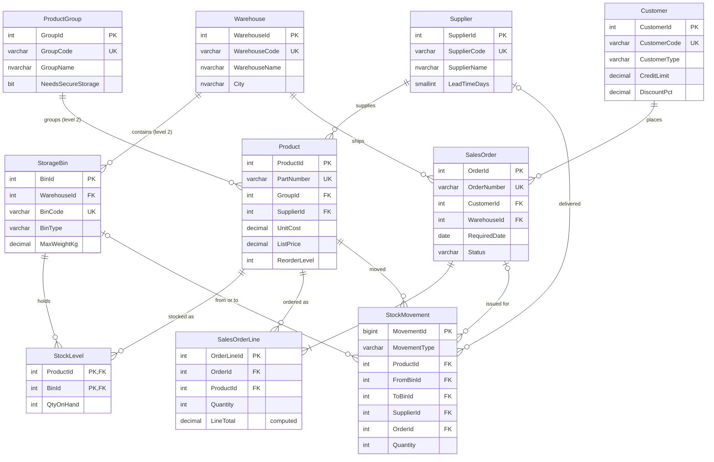

# Marine Spares Database - SQL Server

**HarbourlineDB** is a compact, clean design for a fictional marine spare-parts distributor with stores in Southampton,
Aberdeen and Falmouth - **10 tables, 7 views, 7 stored procedures** in one script. All data is invented.

Every hierarchy is exactly **two levels** deep:

| Parent | Child | Purpose |
|---|---|---|
| Warehouse | StorageBin | where stock is kept |
| ProductGroup | Product | what is sold |
| SalesOrder | SalesOrderLine | what was ordered |

…connected through Supplier, Customer, StockLevel (product × bin) and StockMovement (the stock ledger).

## Highlights

- **Two-level tree in one view** - `vw_WarehouseBinTree` returns each warehouse with totals, followed by its bins (`UNION ALL` + sort key).
- **Group subtotals with `ROLLUP`** - `vw_SalesByGroup` gives product detail, group subtotals and a grand total in one query.
- **Committed vs available stock** - open orders reserve stock per warehouse; inter-warehouse transfers cannot take promised stock.
- **Set-based picking** - `usp_ShipOrder` picks every line in one statement using a running total, emptying the smallest bins first.
- **Business rules in procedures** - bin weight limits, secure storage for distress beacons, credit limits, no double shipping.
- **Ledger reconciliation** - stock rebuilt from `StockMovement` must equal `StockLevel` (the demo checks it: 0 mismatches expected).

## Run it

Open **`HarbourlineDB_Complete.sql`** in SSMS and press **F5**. It builds the database, loads the data, runs a demo through the
procedures (with five deliberately rejected actions) and prints nine showcase result sets. The database diagram is at the end of
the file and below. Requires SQL Server 2017 or later.

## Entity-relationship diagram

---
**YOUR NAME** · [LinkedIn](https://www.linkedin.com/in/khalil-aulfat) · [GitHub](https://github.com/khalilulfat)
